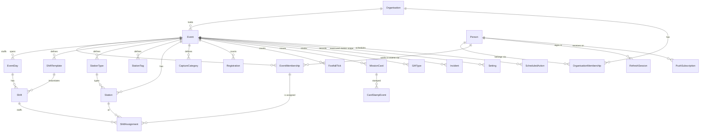

# ADR-001 — Tenancy, event model and API scoping

| Field     | Value                                                                                                                                                                               |
| --------- | ----------------------------------------------------------------------------------------------------------------------------------------------------------------------------------- |
| Status    | Accepted (G1, 2026-09-26; written in P05.2)                                                                                                                                         |
| Decisions | D-02 = A (owner). D-12 = migrate as Event #1 (**assumed**, see [Migration](#migration)). Items marked **assumed** were accepted by the owner's delegation at G1                     |
| Resolves  | F02-001 (merges PF-04); F04 § P04.3 "What changes when data becomes event-scoped" (items 1–6); F02 § Journey 6 requirements 3, 5, 6, 7; F01-001, F01-002, F01-003, F01-006, F01-014 |
| Builds in | P09.1, P09.3, P09.4, P09.5, P09.7, P09.8, P09.9, P09.10                                                                                                                             |

## Context

The data model has no event. `EventDay` has no parent, uniqueness is global (`EventDay.date`,
`Station.code`, `GiftType.name`), and every dashboard, report and export reads every row in the
database (F02-001). Anything added for a second event lands in this year's numbers, so "next year"
means a new database. The owner chose **D-02 A**: many events in one deployment, one organisation,
with an `Organisation` row at the root of the schema so that multi-organisation (D-02 B) can be
added later without migrating every table.

P04 set out what must change once data is event-scoped (F04 § P04.3). Every lookup by id must carry
the event, and that must be enforced below the handlers. Roles become per-event memberships. Station
scope includes the event. Reads, keys and caches are scoped too. Isolation needs its own test matrix.

The model today: 31 tables. `Volunteer` holds identity, contact details and a global role.
Operational rows point at `Volunteer` and `Station`. `AuditLog`, `IdempotencyRecord`,
`RefreshSession`, `PushSubscription` and `AppSetting` are platform-wide.

## Decision

### 1. Entities

- **`Organisation`** (new, one row): `id`, `slug`, `name`, `appName`, `locale`,
  `defaultTimezone`, `branding` JSON. It holds F01-003 and F01-004's platform settings. A second
  row is D-02 B, which this design leaves additive: nothing below it assumes there is only one.
- **`Event`** (new): `id`, `organisationId`, `slug` (unique per organisation), `name`, `venue`,
  `timezone` (IANA), `locale`, `status` (the lifecycle in ADR-004), `dayBoundaryMinutes`
  (ADR-004), `branding` JSON, `clonedFromEventId`, `archivedAt`. It has no start or end date: the
  dates are derived from its `EventDay` rows, so they cannot disagree.
- **`Person`** (was the identity half of `Volunteer`): `id` (the old `Volunteer.id`, kept),
  `cognitoSub` (unique), `displayName`, `email` (unique, case-insensitive), `phone`, `active`
  (platform-wide sign-in switch), `lastSeenAt`. A person belongs to the organisation and is reused
  across events.
- **`OrganisationMembership`** (new): `organisationId`, `personId`, `role` (`MEMBER` or
  `PLATFORM_ADMIN`). Platform admins create, clone and archive events and are the only people who
  can edit guardrails (ADR-005). With one organisation this is one row per person. It exists so
  that D-02 B is a data change, not a schema change.
- **`EventMembership`** (was the role half of `Volunteer`): `id`, `eventId`, `personId`, `role`
  (the fixed catalogue, D-03 A; the per-event label lives with role permissions in ADR-005),
  `portfolio`, `reportsToId` (another membership of the same event), `status` (`INVITED`,
  `ACTIVE`, `DEACTIVATED`, `ENDED`), `invitedAt`, `acceptedAt`, `deactivatedAt`,
  `deactivatedReason`, `lastSeenAt`. Unique on `(eventId, personId)`.
- **Taxonomy and shifts** (`CaptureCategory`, `StationType`, `StationTag`, `ShiftTemplate`,
  `Shift`): ADR-002.
- **Settings and schedules** (`Setting`, `SettingChange`, `ScheduledAction`): ADR-003 and ADR-004.
- **`RolePermission`**: ADR-005. **`ContentDocument`**: ADR-003 (content is versioned
  configuration).

### 2. Scoping rule: every event-owned row carries `eventId`

`eventId` is stored on **every** event-owned row, children included (acknowledgements, follow-ups,
stamp events), not reached through a parent. Two rules make the column trustworthy:

1. **Composite foreign keys keep a row inside its event.** Every parent that event-owned rows point
   at gets `@@unique([eventId, id])`, and every reference is `(eventId, parentId) → (eventId, id)`.
   Postgres then refuses a registration in event A that points at a station, card or membership in
   event B. Nullable references (`Incident.stationId`) are covered as well: under `MATCH SIMPLE` a
   null `stationId` skips the check, and a non-null one must match. No referential action may set
   `eventId` to null, so shared columns use `Restrict` or `Cascade` only, never `SetNull`.
2. **Repositories cannot forget the event.** Every repository function for an event-owned model
   takes an `EventScope` (`{ eventId }`) as its first parameter. `platform/db` adds a Prisma client
   extension that throws `MissingEventScopeError` when a query on an event-owned model has no
   `eventId` in its `where` (reads, updates, deletes) or its `data` (creates). The list of
   event-owned models is generated from the schema by a `/// @eventOwned` doc comment on each
   model, so a new table cannot be left out. The extension runs in every environment. In
   production a violation fails the request and logs an error. It is a bug, never a user error.

`findUnique({ id })` on an event-owned model is therefore impossible. The id lookup becomes
`findFirst({ where: { eventId, id } })`, backed by the `(eventId, id)` unique index.

### 3. Tables

| Table (today)                                           | Change                                                                                                      | Unique and index changes                                                                                      |
| ------------------------------------------------------- | ----------------------------------------------------------------------------------------------------------- | ------------------------------------------------------------------------------------------------------------- |
| —                                                       | **new** `Organisation`, `Event`, `OrganisationMembership`, `EventMembership`                                | `Event (organisationId, slug)`; `EventMembership (eventId, personId)`; `(eventId, role, status)`              |
| `Volunteer`                                             | **split** → `Person` (identity) + `EventMembership` (role, portfolio, reportsTo, active)                    | `Person.email`, `Person.cognitoSub` stay unique                                                               |
| `EventDay`                                              | + `eventId`                                                                                                 | `@@unique([date])` → `@@unique([eventId, date])`                                                              |
| `Station`                                               | + `eventId`; `kind`/`courseCode` → `typeId`/tags (ADR-002)                                                  | `code` unique → `@@unique([eventId, code])`; `@@index([eventId, typeId, active])`                             |
| `ShiftAssignment`                                       | + `eventId`; `volunteerId` → `membershipId`; `eventDayId`+`block` → `shiftId` (ADR-002)                     | `@@unique([membershipId, shiftId])`; `@@index([eventId, stationId, shiftId])`                                 |
| `Attendance`, `AttendanceChallenge`                     | + `eventId`; `volunteerId`/`issuerId`/`verifiedById` → membership ids                                       | `(membershipId, eventDayId)`; `(eventId, eventDayId, presentAt)`                                              |
| `AttendanceAttempt`                                     | key `volunteerId` → `membershipId`; + `eventId`                                                             | PK `membershipId`                                                                                             |
| `ShiftSwapRequest`, `BriefingSlot`                      | + `eventId`; people → membership ids                                                                        | `(eventId, status)`; `(eventId, eventDayId, startsAt)`                                                        |
| `Registration`                                          | + `eventId`; `category` → `categoryId` (ADR-002); `recordedById` → membership                               | `(eventId, recordedAt)`, `(eventId, categoryId, recordedAt)`, `(eventId, groupId)`                            |
| `FootfallTick`                                          | + `eventId`; `recordedById` → membership                                                                    | `(eventId, stationId, recordedAt)`, `(eventId, recordedAt)`                                                   |
| `MissionCard`                                           | + `eventId`                                                                                                 | `shortCode` unique → `@@unique([eventId, shortCode])`; `qrPayload` stays globally unique; `(eventId, status)` |
| `CardStampEvent`                                        | + `eventId`; `recordedById` → membership                                                                    | `@@unique([missionCardId, stationId])` stays; `(eventId, recordedAt)`                                         |
| `GiftType`                                              | + `eventId`                                                                                                 | `name` unique → `@@unique([eventId, name])`                                                                   |
| `GiftRedemption`, `GiftStockAdjustment`                 | + `eventId`; people → membership ids                                                                        | `(eventId, giftTypeId, recordedAt)`                                                                           |
| `Incident`, `IncidentFollowUp`                          | + `eventId`; people → membership ids                                                                        | `(eventId, status, severity)`, `(eventId, reportedAt)`                                                        |
| `LostPersonAlert`, `LostPersonAck`, `LostPersonSummary` | + `eventId`; people → membership ids                                                                        | `(eventId, status)`                                                                                           |
| `LostFoundItem`                                         | + `eventId`; `loggedById` → membership                                                                      | `(eventId, status)`, `(eventId, foundAt)`                                                                     |
| `Announcement`, `AnnouncementAck`                       | + `eventId`; `targetRole` stays the catalogue role; people → membership ids                                 | `(eventId, createdAt)`                                                                                        |
| `FallbackWindow`, `ImportBatch`                         | + `eventId`; people → membership ids                                                                        | `(eventId, startedAt)`, `(eventId, endedAt)`, `(eventId, importedAt)`                                         |
| `AppSetting`                                            | replaced by `Setting` + `SettingChange` with scope `platform`, `event` or `station` (ADR-003)               | `(scope, scopeId, key)`                                                                                       |
| `AuditLog`                                              | + nullable `eventId` (null for platform actions); `actorId` → `personId`, + `membershipId` when in an event | `(eventId, createdAt)`, `(eventId, entityType, entityId)`; existing indexes kept                              |
| `IdempotencyRecord`                                     | + nullable `eventId`; a replay must match key, actor, endpoint **and** event, or it is refused (409)        | PK `key` stays                                                                                                |
| `RefreshSession`, `PushSubscription`                    | `volunteerId` → `personId`. Stay platform-wide: a session belongs to the human, not an event                | unchanged                                                                                                     |

Every table above is marked `/// @eventOwned`, except `Person`, `Setting` (scoped by its own
`scope` column), `AuditLog` and `IdempotencyRecord` (nullable `eventId`), and `RefreshSession` and
`PushSubscription`. People references
inside an event point at `EventMembership`, because a membership is who acted in that event: the
role they held and the event it was in are part of the fact. References about the human (sessions,
push subscriptions, the audit actor) point at `Person`.

### 4. API: path-scoped

- Event data lives under **`/api/v1/events/:eventId/…`**: `/api/v1/events/:eventId/registrations`,
  `/…/stations/:stationId`, and so on. A request can name only one event, and the event is visible
  in logs, the WAF and the audit trail.
- Platform routes stay outside the scope: `/api/v1/auth/*`, `/api/v1/me` (the person, their
  memberships and their devices), `/api/v1/events` (list, create, clone: platform admins),
  `/api/v1/organisation` (organisation settings), `/healthz` and `/readyz`.
- `:eventId` is the event's id, never its slug. Ids are stable. Slugs are for people and can
  change while an event is in `DRAFT`.
- An **event-context middleware** runs after authentication. It loads the event and the caller's
  active membership (cached, invalidated on the `membership` bus channel, ADR-003) and puts an
  `EventScope` on the request context. It returns **404** for an event that does not exist and for
  one the caller has no membership of, so the response never tells an outsider an event exists.
  Platform admins without a membership get a read-only scope for administration (ADR-005).
- Handlers never read `eventId` from the body. The scope comes from the path, and only from the
  path.

### 5. Client: an event route segment

- Event screens move under **`/e/[event]/…`**, where `[event]` is the slug: `/e/spoh-2027/capture`,
  `/e/spoh-2027/chief`, `/e/spoh-2027/tv`. Platform screens stay outside it: `/sign-in`, `/events`
  (the picker, and create or clone for platform admins), `/account` (profile and devices).
- `/` sends a person with one active membership to that event. A person with several goes to
  their last-used event (remembered per device) or to `/events`.
- The shell shows an **event switcher** only when the person has more than one active
  membership. Switching events navigates. It never changes the scope of the page already open.
- Every TanStack Query key starts with `eventId`. Every outbox entry stores the `eventId` and the
  full path it will be sent to (ADR-009 covers entries queued by the old build).

### 6. Cloning

`cloneEvent` is a **plan/apply** use case (engineering-standards §1: no boolean mode flags):

- `planClone(source, options)` returns what will be created: counts per table, dates shifted,
  and conflicts such as a slug in use or a day falling outside the new range. The wizard (P13.2)
  shows this plan.
- `applyClone(plan)` runs in one transaction. It creates the event in `DRAFT`, copies the
  structure with an id remap, writes one `event.clone` audit row, and links the role-permission
  policies for the new event (ADR-005).

| Copied (structure)                                                                                                                                                                                                            | Not copied (operations)                                                                                                                                     |
| ----------------------------------------------------------------------------------------------------------------------------------------------------------------------------------------------------------------------------- | ----------------------------------------------------------------------------------------------------------------------------------------------------------- |
| days (shifted by the offset), shift templates and shifts, station types, tags, stations, categories, gift types (stock reset: no adjustments or redemptions), published content, event and station settings, role permissions | captures, cards and batches, redemptions, incidents, alerts, lost-and-found, announcements, fallback windows, imports, scheduled actions, audit, attendance |
| memberships **only** with "invite the same people": role, portfolio and `reportsTo` remapped, status `INVITED`                                                                                                                | memberships otherwise                                                                                                                                       |

Settings that point at a membership, such as the attendance root (F02-017), are copied only
together with the memberships. Otherwise they are cleared, and the go-live checklist (P13.6)
reports them as unset.

## Options considered

| Topic                      | Chosen                                                                               | Rejected, and why                                                                                                                                                                                                                                                                                                                              |
| -------------------------- | ------------------------------------------------------------------------------------ | ---------------------------------------------------------------------------------------------------------------------------------------------------------------------------------------------------------------------------------------------------------------------------------------------------------------------------------------------- |
| Tenancy root               | `Organisation → Event`, one organisation (D-02 A)                                    | multi-organisation now (D-02 B): a tenant layer on every query for a need nobody has; one event per database (D-02 C): the F02-001 problem, kept                                                                                                                                                                                               |
| Where `eventId` lives      | on every event-owned row, with composite FKs                                         | only on top-level rows, reached through parents: every guard and index needs a join, and a child can point into another event                                                                                                                                                                                                                  |
| Enforcement below handlers | repository `EventScope` plus a Prisma extension that throws, and the isolation suite | **Postgres row-level security** with `SET LOCAL app.event_id`: strongest in principle, but every query would have to run inside an interactive transaction to carry the setting. Prisma's pooled queries outside a transaction would silently bypass it, and platform-admin reads need a bypass role. Revisit if the guard ever misses a case. |
| API scoping                | path (`/events/:eventId/…`)                                                          | an `X-Event-Id` header: invisible in logs and caches, easy to forget on one call, and a request could mix a path from one event with a header from another                                                                                                                                                                                     |
| Client scoping             | `/e/[slug]/…` segment                                                                | event held in client state only: links could not be shared, refreshes lose it, and two tabs could show two events without saying so                                                                                                                                                                                                            |
| People                     | `Person` + `EventMembership`                                                         | a `Volunteer` row per event: duplicate identities in one Cognito pool, and a second invite to the same email fails                                                                                                                                                                                                                             |
| Id in the API              | the event id                                                                         | the slug: it changes, and it leaks event names into logs                                                                                                                                                                                                                                                                                       |

## Consequences

- A second event can exist beside the first. Its days, stations, gifts, people and numbers are
  separate by construction (F02-001; Journey 6 requirements 6 and 7).
- A person can be a Volunteer at one event and Chief at another. Ending an event ends its
  memberships and leaves identities alone (Journey 6 requirement 3).
- Every repository signature changes (the scope parameter), which P06's module structure makes a
  mechanical change. The extension costs one object inspection per query.
- `@@unique([eventId, id])` adds one index per parent table, about 12 small indexes.
- Every route path changes. Old paths stay for one release as **aliases** of Event #1's paths:
  an internal rewrite, not an HTTP redirect, so a queued POST keeps its body and idempotency key
  (ADR-009). Queued outbox items and installed PWAs keep working.
- Platform admins need an explicit read-only scope for events they are not members of. It is an
  audited action, not a bypass.
- Reports that compare events ("this year versus last") are platform-level reads across scopes.
  They are out of scope for this programme and would need their own ADR.

## How it is tested

1. **Isolation suite** (P09.7), generated from the route inventory. For every route that takes an
   id: a caller with a membership in event A, using an id from event B, gets 404, and so does a
   caller with no membership in the path's event. It must cover 100 % of the inventory.
2. **Guard tests:** for every `@eventOwned` model, a query without `eventId` throws
   `MissingEventScopeError`. A schema lint fails if a model with an `eventId` column lacks the
   marker, or if a marked model lacks a composite FK to any parent it references.
3. **Database tests:** inserting a row whose `(eventId, parentId)` points into another event fails
   with a foreign-key violation, for each parent.
4. **Clone tests** (P09.9): cloning Event #1 gives an event with the same structure counts, zero
   operational rows, shifted dates, and no id shared with the source. With "invite the same
   people", it also gets `INVITED` memberships whose reporting lines resolve inside the new event.
5. **Two events at once** in e2e (P09.8): a volunteer in both events sees each event's shifts,
   stations and counts only under its own segment.

## Migration

Expand → migrate → contract, across separate deploys (P09; ADR-009 sets the release windows):

1. **Expand** (P09.1, P09.3): create `Organisation`, `Event`, `OrganisationMembership` and
   `EventMembership`. Rename the Prisma model `Volunteer` to `Person` with `@@map("Volunteer")`,
   which is a code change only: the table, its ids and every `cognitoSub` link stay as they are.
   Add a nullable `eventId` and the new nullable FK columns to every table, plus the indexes, with
   `CREATE INDEX CONCURRENTLY` where a table is large. The app does not read them yet.
2. **Migrate** (P09.4, **D-12 assumed: migrate**): create the organisation from today's
   hardcoded identity (F01-003, F01-004), then Event #1 "SPOH 2027" with timezone
   `Asia/Singapore`, and backfill every `eventId`.
   Create one `EventMembership` per volunteer with their role, portfolio, reporting line and
   active flag, and repoint people columns to memberships. The P09.4 totals script proves the
   counts per category, station and day are identical before and after. If the owner chooses
   "start empty" instead, this step creates the organisation and people only, and Event #1 is set
   up through the admin UI (P13).
3. **Switch** (P09.5, P09.7, P09.8): repositories read and write through `EventScope`, the API
   moves under `/events/:eventId`, and the client under `/e/[event]`. Old paths are served as aliases
   of Event #1's paths.
4. **Contract** (P09.10): make `eventId` `NOT NULL`, add the composite FKs, drop the global unique
   constraints and the columns replaced by memberships (`Volunteer.role`, `portfolio`,
   `reportsToId`), rename the table to `Person`, and remove the aliases when the outbox window
   closes (ADR-009).

Each step before the contract is reversible by redeploying the previous image, because the old
columns stay authoritative until the switch.
