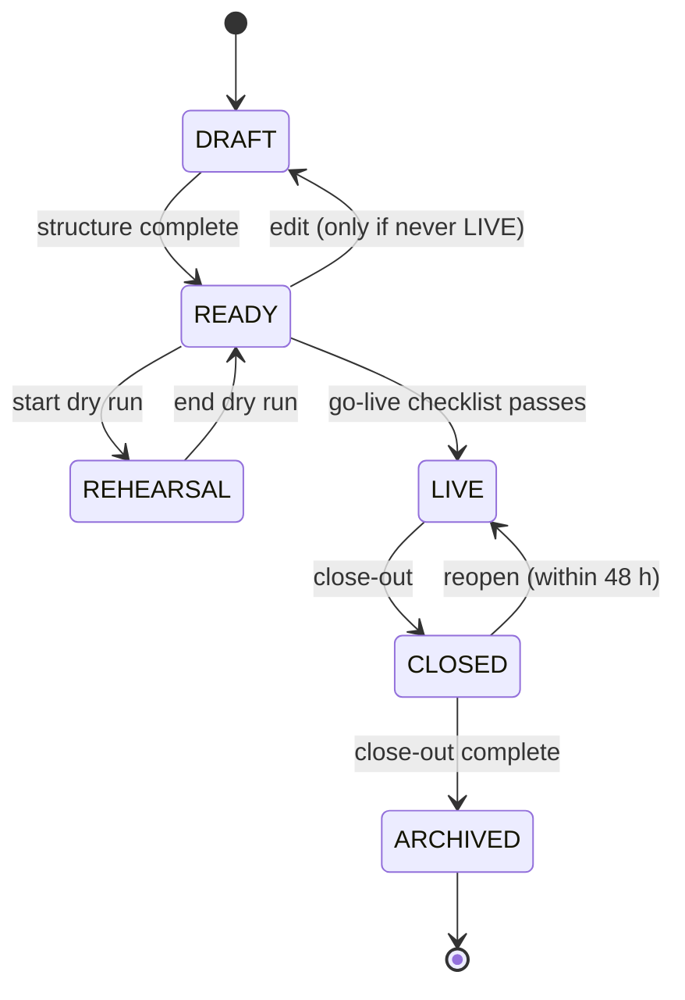

# ADR-004 — Event lifecycle and scheduling

| Field     | Value                                                                                                                                                                               |
| --------- | ----------------------------------------------------------------------------------------------------------------------------------------------------------------------------------- |
| Status    | Accepted (G1, 2026-09-26; written in P05.5)                                                                                                                                         |
| Decisions | D-09 = A, a Postgres job table (design). Q-P2 (events past midnight, with a day-boundary hour): **assumed**. Items marked **assumed** were accepted by the owner's delegation at G1 |
| Resolves  | F03-031; F03-013; PF-07's `SHIFT_HOURS_ALWAYS_OPEN`; F02 § Journey 6 requirements 1, 2, 4; F02-028 (the purge becomes visible); F04-014 (the purge handlers)                        |
| Builds in | P10.5, P10.6, P10.7, P10.8, P13.6, P13.8                                                                                                                                            |

## Context

- An event has no state today. Capture is open whenever a shift block is running, in Singapore
  time. Dry runs keep capture open with the dev-only env flag `SHIFT_HOURS_ALWAYS_OPEN`, which
  production refuses, so a rehearsal on the production system is impossible. Nothing freezes an
  event after it ends, or makes it read-only. Close-out is a set of unrelated API calls (F02 §
  Journey 6).
- "Today" starts at 08:00 local time (F03-013), and nothing allows a shift after midnight.
- Four `setInterval` jobs run in every process: the lost-person purge (15 min), the idempotency
  prune and the refresh-session prune (daily), and the settings refresh (60 s). Every worker runs
  the purge, so summaries are written twice (F03-031). Nothing records whether a job ran, and a
  failure is only a log line.
- The programme needs actions at a set time: publish an announcement, open a station, apply a
  setting, move the event to `LIVE`, purge per the retention schedule (ADR-003 §8).

## Decision

### 1. Lifecycle



The machine is a pure domain module, `events/domain/lifecycle.ts`, with a transition table. Each
transition names its Cedar action (ADR-005), its guard and its side effects:

| Transition        | Action            | Guard                                                                                                                                      | Side effects (one transaction, then post-commit)                                                                                                                                                                                                                                                                                                                                       |
| ----------------- | ----------------- | ------------------------------------------------------------------------------------------------------------------------------------------ | -------------------------------------------------------------------------------------------------------------------------------------------------------------------------------------------------------------------------------------------------------------------------------------------------------------------------------------------------------------------------------------- |
| DRAFT → READY     | `Event.MarkReady` | the **structure** checks pass: timezone, at least one day, one shift template, one station type, categories if any type registers visitors | none                                                                                                                                                                                                                                                                                                                                                                                   |
| READY → DRAFT     | `Event.MarkReady` | the event has never been `LIVE`                                                                                                            | none                                                                                                                                                                                                                                                                                                                                                                                   |
| READY → REHEARSAL | `Event.Rehearse`  | the structure checks pass                                                                                                                  | capture opens outside shift hours; rows are written with `rehearsal = true`; a banner shows on every screen; only rehearsal card batches are accepted                                                                                                                                                                                                                                  |
| REHEARSAL → READY | `Event.Rehearse`  | none                                                                                                                                       | rehearsal fallback windows close; rehearsal data stays, flagged and excluded from reports                                                                                                                                                                                                                                                                                              |
| READY → LIVE      | `Event.GoLive`    | the **go-live checklist** (P13.6) passes. A platform admin may override a failing item with a written reason, which is audited             | capture follows the shift schedule; rehearsal card batches are refused; poll cadence and notifications move to their live values                                                                                                                                                                                                                                                       |
| LIVE → CLOSED     | `Event.Close`     | none blocks. Open incidents, open fallback windows, unresolved alerts and held items are **listed** in the close-out flow                  | new capture is refused, except **queued captures whose `clientRecordedAt` is before the close, accepted for a grace period** (`capture.lateSyncHours`, default 24) so phones that were offline can still sync; fallback windows close; lost-and-found `HELD` → `UNCLAIMED_AT_CLOSE`; the final report is frozen as a snapshot (Journey 6 req. 2); the `ARCHIVED` reminder is scheduled |
| CLOSED → LIVE     | `Event.Reopen`    | within 48 h of the close; platform admin; a reason                                                                                         | the frozen report is marked superseded                                                                                                                                                                                                                                                                                                                                                 |
| CLOSED → ARCHIVED | `Event.Archive`   | the lost-person purge has run for every resolved alert; the final report exists; no queued captures are left in the grace period           | the event becomes read-only (every write is refused by a `forbid` policy, ADR-005); memberships become `ENDED`; the event is hidden from volunteers (Journey 6 req. 4); the retention timers (ADR-003 §8) and the archive snapshot (ADR-008) are scheduled                                                                                                                             |

- **Every transition** is audited with its guard results. It publishes `event.state` on the cache
  bus, and the new state reaches Cedar as `context.eventPhase` (ADR-005).
- **Close-out** (P13.8) is one guided flow in the order of Journey 6 requirement 1. It ends with
  the `LIVE → CLOSED` transition, and then offers `ARCHIVED` and "start next year's event from this
  one" (ADR-001 §6).
- **Guards are pure functions** of a readiness snapshot. The same functions produce the Overview
  checklist (P13.6), so what the screen says and what the transition enforces cannot differ.

### 2. Rehearsal replaces `SHIFT_HOURS_ALWAYS_OPEN`

- In `REHEARSAL`, "on shift" means **assigned to the station on any shift of the event**, at any
  hour, so a dry run needs no clock tricks. IC-and-above keep their any-station scope (ADR-005).
- Every capture row gets a `rehearsal` boolean: `Registration`, `FootfallTick`, `CardStampEvent`,
  `GiftRedemption`, `Incident`, `LostPersonAlert` and `LostFoundItem`. Reports, dashboards and
  exports exclude rehearsal rows by default. A "show rehearsal data" toggle includes them,
  clearly labelled.
- **Cards:** a card batch is generated as `rehearsal` or `live` (P13.3). A rehearsal card is
  refused while `LIVE`, and a live card is refused in `REHEARSAL`. So a dry run cannot stamp,
  complete or spend the real cards.
- Development uses the same mechanism: the dev fixture event is created in `REHEARSAL`. The env
  flag is deleted.

### 3. Day boundary and shifts past midnight (Q-P2, **assumed**)

- `Event.dayBoundaryMinutes` (default 240, which is 04:00) says when an event's "today" begins in
  its timezone. The dashboard's "today" is `[boundary, next boundary)` of the current event day,
  not from 08:00 (F03-013).
- A capture belongs to the event day whose window contains its `recordedAt`. A shift template may
  end the next day (ADR-002).

### 4. The scheduler (D-09 = A)

**`ScheduledAction`**: `id`, `eventId` (null for platform jobs), `type`, `payload` (JSON, validated
by the handler's schema), `runAt`, `status` (`PENDING`, `RUNNING`, `SUCCEEDED`, `FAILED`, `DEAD`,
`CANCELLED`), `attempts`, `maxAttempts` (default 5), `lastError`, `lockedBy`, `lockedUntil`,
`recurrence` (null, or an interval for system jobs), `dedupeKey` (unique, nullable), `version`,
`createdByPersonId` (null for the system), `createdAt`, `completedAt`.

**Worker.** Every API instance runs one worker loop, every 5 s:

1. **Claim** in its own short transaction, and commit:

   ```sql
   UPDATE "ScheduledAction" SET status = 'RUNNING', "lockedBy" = $instance,
          "lockedUntil" = now() + interval '5 minutes', attempts = attempts + 1
    WHERE id IN (SELECT id FROM "ScheduledAction"
                  WHERE (status = 'PENDING' AND "runAt" <= now())
                     OR (status = 'RUNNING' AND "lockedUntil" < now())   -- a crashed worker's lease
                  ORDER BY "runAt" FOR UPDATE SKIP LOCKED LIMIT 5)
   RETURNING *;
   ```

   Two workers never claim the same row, and a row whose worker died is reclaimed when its lease
   expires.

2. **Run** each claimed action in **one transaction**: the handler's writes, the status change to
   `SUCCEEDED`, the audit row (`source: schedule`, `scheduledActionId`) and, for a recurring job,
   the next occurrence (by `dedupeKey`, so there is only ever one). A handler whose effects are all
   in the database therefore happens **exactly once**. Its effects and its completion commit
   together, or neither does.
3. **External effects** (push, email) run **after** the commit, from the rows the handler wrote,
   and are idempotent per recipient (a delivery key). A retry never double-sends.
4. **Failure:** the transaction rolls back. The action goes back to `PENDING` with `runAt` backed
   off (30 s, 2 min, 10 min, 30 min) and `lastError` set. After `maxAttempts` it becomes `DEAD`, an
   alarm fires (ADR-008), and it appears red on the schedule screen.
5. **Late running:** an action carries the time it was due. A handler whose effect no longer makes
   sense refuses it with a reason, recorded as `FAILED`, never silently. For example, an
   announcement past its expiry, or a lifecycle transition whose guard now fails.

**Two kinds of job**, both registered through `platform/scheduler`:

- **Scheduled actions** (above): cluster-wide, exactly once, audited, visible on the schedule
  screen. Everything with a business effect.
- **Local ticks**: per instance, in memory, not audited. Only cache maintenance: the 60 s settings
  backstop (ADR-003) and the bus reconnect. They are the only timers allowed outside a handler.

**Editing.** Only a `PENDING` action can be edited or cancelled, with `expectedVersion`, and every
change is audited. Creating an action requires the Cedar action of the thing it will do, checked
**at creation and again when it runs**, against the creator's permissions at that moment. A
scheduled action therefore cannot outlive its author's authority.

### 5. Handler catalogue

| Type                                   | Payload                                                    | Registered by   | Replaces                       |
| -------------------------------------- | ---------------------------------------------------------- | --------------- | ------------------------------ |
| `event.transition`                     | `{ to }`                                                   | `events`        | —                              |
| `announcement.publish`                 | `{ announcementId }` (a saved draft)                       | `announcements` | —                              |
| `setting.apply`                        | `{ scope, scopeId, key, value }`                           | `settings`      | —                              |
| `taxonomy.setActive`                   | `{ kind: category \| stationType \| station, id, active }` | `taxonomy`      | —                              |
| `fallback.remind`                      | `{ windowId }`                                             | `fallback`      | —                              |
| `report.snapshot`                      | `{ kind: daily \| final }`                                 | `reports`       | —                              |
| `lostPerson.purge` (recurring, 15 min) | —                                                          | `lostPersons`   | the per-worker purge (F03-031) |
| `idempotency.prune` (daily)            | —                                                          | `platform`      | the interval job               |
| `session.prune` (daily)                | —                                                          | `identity`      | the interval job               |
| `retention.purge` (daily)              | `{ class }`, one per ADR-003 §8 row                        | `platform`      | —                              |
| `rateLimit.prune` (hourly)             | —                                                          | `platform`      | —                              |
| `event.archiveReminder`                | —                                                          | `events`        | —                              |

"Open or close capture per station, category or day" (P10.7) is `setting.apply` on a
`capture.open` setting (event or station scope), or `taxonomy.setActive` for a category. It is not
a separate mechanism.

Recurring system jobs are created at boot by `ensureRecurring(type, interval)`, an upsert by
`dedupeKey`. Every instance calls it, and only one row results.

## Options considered

| Topic                     | Chosen                                                 | Rejected, and why                                                                                                                                                                                                                                                                                         |
| ------------------------- | ------------------------------------------------------ | --------------------------------------------------------------------------------------------------------------------------------------------------------------------------------------------------------------------------------------------------------------------------------------------------------- |
| Scheduler engine          | Postgres table, `SKIP LOCKED`, lease (D-09 A)          | EventBridge Scheduler (D-09 B): no transaction with the change that schedules it, a call back into the app for every action, and tests need AWS or a fake. pg-boss or Graphile Worker: sound libraries, but a dependency with its own schema and migrations for about 100 lines of code the team can read |
| Leader election           | none: every worker claims                              | one leader runs everything: a failover gap, and the leader is a special case in every test                                                                                                                                                                                                                |
| Rehearsal                 | a lifecycle state, flagged rows, separate card batches | a separate "rehearsal event" cloned for each dry run: dry runs could not test the real event's setup. Keeping the env flag: impossible in production                                                                                                                                                      |
| Late captures after close | accepted if recorded before the close, for 24 h        | refusing everything after the close: every phone that was offline at the end loses its queue                                                                                                                                                                                                              |
| Reopening                 | within 48 h, platform admin, audited                   | no reopen: a mistaken close would need SQL. Unlimited reopen: the final report never settles                                                                                                                                                                                                              |

## Consequences

- Dry runs can run on the production system without affecting the real event's numbers or cards.
- Every business effect in time is visible, editable and audited. It runs once across all
  instances (F03-031), and its failures page someone.
- Each instance polls the table every 5 s: one indexed query on a small table. The poll interval
  bounds the scheduling precision to about 5 s, which is enough for announcements and
  transitions.
- Adding the `rehearsal` column to seven tables adds a filter to every report query. The report
  suite checks it.
- A stuck handler holds its lease for 5 minutes before another worker retries it. Handlers are
  written to finish in seconds, and a longer one (a report snapshot) extends its lease.

## How it is tested

- **Lifecycle:** a table-driven test walks every (from, to) pair: legal ones pass their guard
  fixtures, illegal ones are refused. Each side effect has its own use-case test. The checklist
  and the guard share fixtures (P13.6).
- **Scheduler** (P10.6), with a fixed `Clock` and a manual tick:
  - claim, run and complete;
  - retry with backoff, then dead-letter after `maxAttempts`;
  - **two workers** claiming concurrently never run the same action (a repeated-rounds test like
    P03's race tests);
  - a crashed worker's lease is reclaimed;
  - a recurring job has exactly one next occurrence;
  - a handler that throws leaves no partial writes;
  - a permission removed between creation and run makes the run refuse.
- **Time travel** (P10.9): schedule a setting change and an announcement, advance the clock, see
  them apply, then revert.
- **Rehearsal:** capture outside shift hours works in `REHEARSAL` and is refused in `LIVE`.
  Rehearsal rows are absent from reports by default. Rehearsal cards are refused while `LIVE`.
- **Close:** a queued capture recorded before the close syncs after it, and one recorded after
  is refused.

## Migration

1. **P10.5:** add `Event.status`. Event #1 starts in `READY` (or `REHEARSAL` for dry runs), and
   moves to `LIVE` for the event through the UI. Add the `rehearsal` columns, defaulting to
   `false`. Existing rows are live data.
2. **P10.6–P10.7:** create `ScheduledAction`. Move the four interval jobs: three become recurring
   actions, and the settings refresh becomes a local tick. Delete `jobs/scheduler.ts` and
   `SHIFT_HOURS_ALWAYS_OPEN`. Until then, P06.13 makes the purge claim each alert with a
   conditional update, so two workers cannot both summarise it (F03-031).
3. **P10.8:** the schedule timeline and lifecycle controls. **P13.6 and P13.8:** the checklist and
   the close-out flow.
