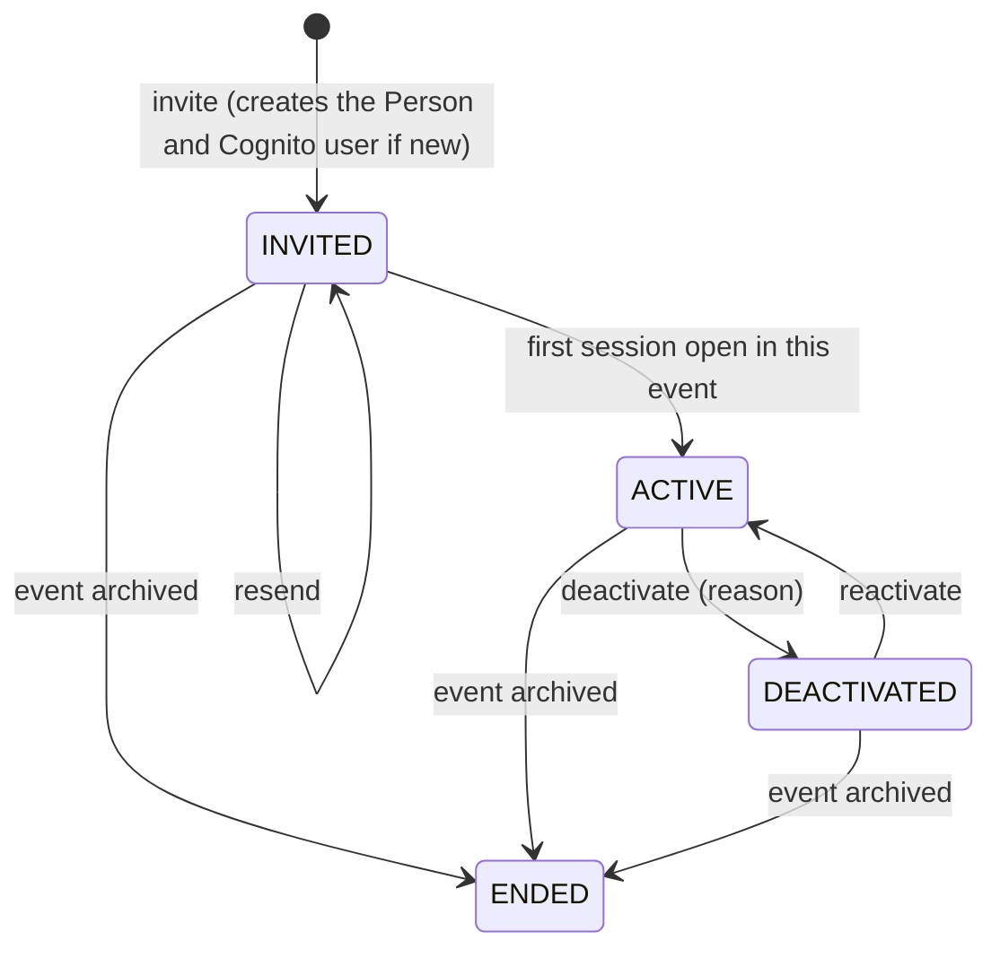

# ADR-006 — Identity on Cognito

| Field     | Value                                                                                                                                                                                                                          |
| --------- | ------------------------------------------------------------------------------------------------------------------------------------------------------------------------------------------------------------------------------ |
| Status    | Proposed (P05.7, 2026-09-26)                                                                                                                                                                                                   |
| Decisions | D-08: a domain registered in Route 53 and SES with DKIM (**assumed**, the domain name is still needed). The Cognito pool's current settings (Q-C1…Q-C9) are unknown under D-13, so the hardening below is a target, not a diff |
| Resolves  | F04-001, F04-002, F04-023, F02-032, F03-010, F03-009 (the session half), F01-029, F01-033; P02 § Journey 6 requirement 3 (memberships end with the event)                                                                      |
| Builds in | P08.6, P12.1–P12.7                                                                                                                                                                                                             |

## Context

- **What holds today** (F04 § P04.2): the API issues its own short, thin access tokens. Roles are
  read from the roster on every request. Refresh tokens are opaque, hashed and rotated, with reuse
  detection. The Hosted UI hand-off uses PKCE and `state`. The client never sees a Cognito token.
  All of this stays.
- **What does not:**
  - `requireAuth` also accepts raw Cognito access tokens, which skip revocation (F04-001).
  - Two tabs refreshing at once fork a session family and sign the person out everywhere (F02-032,
    F03-010).
  - A revoke can take up to 60 s to bite (F03-009).
  - The pool's password, MFA, threat-protection and token settings are not recorded anywhere, and
    the runbook's client update silently resets several of them (F04-002).
  - Invites use Cognito's default sender: about 50 emails a day, with temporary passwords valid 7
    days (F04-023). Training on 4 Nov needs 200+ invites.
- **The pool `ap-southeast-1_9bwl2nGF7` holds real identities.** Every `Volunteer.cognitoSub`
  points into it, and it must never be replaced.
- **Prices** (AWS Price List, `AmazonCognito` ap-southeast-1, version `20260911124417`, fetched
  2026-09-26): Essentials US$0.015 per MAU, with a global free tier of 10,000 MAU; Plus US$0.02
  per MAU, with no free tier. Plus is the tier that includes threat protection.

## Decision

### 1. Pools per environment

| Environment | Pool                                                                                                    | Tier                                                                                                        | Why                                                                                          |
| ----------- | ------------------------------------------------------------------------------------------------------- | ----------------------------------------------------------------------------------------------------------- | -------------------------------------------------------------------------------------------- |
| production  | **the existing pool**, imported into CDK (`cdk import`), `RemovalPolicy.RETAIN`, deletion protection on | **Plus** (threat protection, enforced), about US$7 in an event month at 350 active users; ADR-008 prices it | real identities; the target of credential stuffing                                           |
| staging     | a **new** pool created by CDK, holding synthetic test users only                                        | Essentials (free under 10,000 MAU)                                                                          | staging never touches a real person. Its e2e users can use `ADMIN_USER_PASSWORD_AUTH` safely |

The Lightsail deployment keeps using the existing pool until the cutover (P15.8). The production
stack adds **a new app client** to that pool, with the new domain's callback, and the old client is
retired after the cutover. The existing client is not modified, so today's deployment cannot break
mid-programme.

### 2. Pool configuration as code (target)

| Setting                       | Target                                                                                                                         | Finding / reason |
| ----------------------------- | ------------------------------------------------------------------------------------------------------------------------------ | ---------------- |
| Self sign-up                  | off (`AllowAdminCreateUserOnly`)                                                                                               | F04-002          |
| Password policy               | minimum 12 characters, lowercase and digits                                                                                    | F04-002, Q-C1    |
| MFA                           | pool: `OPTIONAL`, TOTP only (no SMS: cost, and SIM-swap risk). The app **requires** it for admin tiers (§3)                    | F04-002, Q-C2    |
| Threat protection             | Plus tier, **enforced** in production                                                                                          | F04-002, Q-C3    |
| Prevent user-existence errors | on                                                                                                                             | Q-C5             |
| Token revocation              | on                                                                                                                             | Q-C4             |
| Cognito token lifetimes       | ID and access 5 minutes, refresh 60 minutes (the minimums). They are used once, at the callback; the API issues its own tokens | F04-001          |
| App client auth flows         | authorization code with PKCE only, plus `ALLOW_REFRESH_TOKEN_AUTH`. **No** `USER_SRP` or `ADMIN_USER_PASSWORD` in production   | F04-001          |
| Temporary password validity   | **30 days**, so an invite sent in early October still works at training                                                        | F04-023, Q-C7    |
| Email                         | SES, developer mode, from `no-reply@<domain>` (§4)                                                                             | F04-023, Q-C6    |
| Deletion protection           | on                                                                                                                             | Q-C9             |
| Callback and logout URLs      | per environment, from CDK config; no `localhost` in production                                                                 | Q-C9             |
| Managed login branding        | the organisation's name and colours                                                                                            | P12.1            |

**Immutable properties** (sign-in aliases, case sensitivity, the required-attribute set) are
imported exactly as they are, because changing them would replace the pool. `cdk diff` on
identity must be empty after the import, and every later change to identity is reviewed as a diff
and confirmed with the owner (P12).

**Unknowns.** The pool's current values (Q-C1…Q-C9) could not be read (D-13). Importing needs
them. Before P12.1, the owner either answers the questions or approves one read-only
`describe-user-pool` and `describe-user-pool-client` (Q-P8).

### 3. MFA by role tier

- **Required** for any person holding a membership of rank 30 or above (Deputy, Chief, Lead,
  Admin) in a non-archived event, and for every platform admin. **Optional** for Volunteers and
  ICs.
- **Enforced by the app at session open** (`POST /auth/session` after the callback).
  `AdminGetUser` shows whether TOTP is enrolled. A person who needs MFA and has none gets a
  **restricted session** that can reach only the MFA enrolment screen. It uses Cognito's
  `AssociateSoftwareToken` and `VerifySoftwareToken`, with the Cognito access token from the
  callback, held server-side for those five minutes only. Once enrolled, Cognito asks for the TOTP
  code at every sign-in.
- **Promotion into an admin tier** (People.AssignRole) sets `mfaRequired`, and the person's next
  session open enforces it. Their current sessions are revoked, so they cannot keep acting in the
  higher role without MFA.

### 4. Invites and email (D-08, **assumed**)

- **SES** in ap-southeast-1: a domain identity with Easy DKIM, a custom MAIL FROM, and a
  configuration set that sends bounces and complaints to SNS, which suppresses addresses and
  alerts. **Production access** (leaving the SES sandbox) is requested as soon as the domain
  exists, because AWS reviews it by hand.
- **Cognito sends the invite** (`AdminCreateUser`) with the organisation-branded template. A pool
  has one template, and D-02 means one organisation per pool, so organisation branding fits.
- **The app sends the event-specific email** ("You're on the SPOH 2028 team: first shift …") itself
  through SES when a membership is created. So the event name reaches people without a Cognito
  Lambda trigger (P12.2 amended).
- Bulk invites are paced within the SES sending rate, and the import screen shows progress
  (P12.4).
- **Until D-08 is answered:** owner action A4 (check the sender and the temporary-password
  validity) and batching under 50 a day are the interim (F04-023).

### 5. Membership lifecycle

| Use case                   | Effect                                                                                                                                                                                                                                                                                                      |
| -------------------------- | ----------------------------------------------------------------------------------------------------------------------------------------------------------------------------------------------------------------------------------------------------------------------------------------------------------- |
| `inviteToEvent`            | Finds the `Person` by email (case-insensitive) or creates it plus the Cognito user. Creates the membership as `INVITED` with a role checked by `People.Invite` and the guardrails (ADR-005). Sends the email.                                                                                               |
| `resendInvite`             | `AdminCreateUser` with `MessageAction: RESEND` if the user has never signed in; otherwise the event email only.                                                                                                                                                                                             |
| `acceptInvite`             | Implicit: the first session open that resolves this event sets `acceptedAt` and makes the membership `ACTIVE`.                                                                                                                                                                                              |
| `changeRole`               | `People.AssignRole` with the guardrails. Sets `mfaRequired` when promoting into an admin tier.                                                                                                                                                                                                              |
| `deactivateMembership`     | The membership becomes `DEACTIVATED`, with a reason. Publishes on `membership`. Its decisions are denied within 2 s everywhere (`guardrail.inactive-member`, ADR-003 bus). Push subscriptions for this event are dropped. The person's sessions are revoked **only if** no other active membership remains. |
| `deactivatePerson`         | Every membership is deactivated, the Cognito user is disabled (`AdminDisableUser`), and every session is revoked. Platform admins only.                                                                                                                                                                     |
| `reactivate…`              | The reverse. It never restores sessions: the person signs in again.                                                                                                                                                                                                                                         |
| `endMemberships` (archive) | Every membership of the event becomes `ENDED` in one audited step (Journey 6 requirement 3). The persons stay in the organisation.                                                                                                                                                                          |

Each use case is audited.

### 6. Sessions

- **Only API-issued tokens are accepted** by `requireAuth` (F04-001). Cognito tokens are verified
  once, at the callback, and never again.
- **Access token:** 15 minutes (`auth.accessTokenTtlSeconds`). **Refresh:** 30 days for
  Volunteers and ICs. For admin tiers, an **idle timeout of 30 minutes** and an absolute limit of
  12 hours (`security.adminIdleMinutes`, `security.adminSessionHours`: platform settings).
- **Concurrent refresh** (F02-032, F03-010):
  - Rotation is a conditional update (`WHERE id = ? AND "revokedAt" IS NULL`), which records
    `replacedById`.
  - A rotated token presented again **within 10 seconds, by the same family**, gets the same
    successor instead of revoking the family. After 10 seconds it is reuse, and the family is
    revoked as today.
  - The client coordinates tabs with the Web Locks API, so only one tab refreshes at a time. The
    grace window is the server-side safety net.
- **Revocation takes effect within 2 s** on every instance, through the `session` bus channel
  (ADR-003), and immediately if the bus is down (bypass).
- **Devices** (P12.5): a "Your devices" screen (list and revoke), and "sign out everywhere" for an
  admin acting on someone below them.

### 7. Cognito groups

Groups play **no part in authorization**. Roles come from memberships and permissions from policy
(ADR-005), and platform-admin status lives in `OrganisationMembership`. The code stops creating role
groups. P12.6 removes existing group memberships with a dry run first, and no group is kept, not
even for break-glass access. Break-glass is a documented procedure: a platform admin is added
through a reviewed database change, which is audited (P16.5).

## Options considered

| Topic                    | Chosen                                                   | Rejected, and why                                                                                                                                                                                |
| ------------------------ | -------------------------------------------------------- | ------------------------------------------------------------------------------------------------------------------------------------------------------------------------------------------------ |
| Pools                    | existing pool for production; a new pool for staging     | one pool for both: staging tests would create and disable real people's accounts. A new production pool with migration: every volunteer re-registers, and the `cognitoSub` links break           |
| MFA                      | TOTP, required by the app for admin tiers                | required at pool level for everyone: 300 students enrolling authenticators before training. SMS: cost and SIM swaps. Optional for all: an admin password alone guards every roster row (F04-002) |
| Threat protection        | Plus, enforced, in production                            | Essentials without it: saves about US$7 in event months and loses the compromised-credential and adaptive checks. It is the fallback if ADR-008 must cut                                         |
| Event-branded email      | the app sends it through SES                             | a Cognito `CustomMessage` Lambda: another deployable, and it runs inside Cognito's timeout for every message                                                                                     |
| Passwordless (email OTP) | not now                                                  | it would remove temporary-password expiry altogether, but how it combines with required MFA for admins needs its own spike. Listed for after the event                                           |
| Concurrent refresh       | conditional rotation, a 10 s grace, and tab coordination | a longer refresh lock: slower and still racy across devices. No reuse detection: loses the leaked-cookie protection                                                                              |

## Consequences

- Admin accounts need a second factor. The first sign-in after promotion includes enrolment, and
  the training plan must allow for it (P16.6).
- Invites stop being capped at 50 a day and last 30 days. SES production access is a lead-time
  item that depends on D-08.
- A person's second tab no longer signs them out. A token stolen and replayed after 10 s still
  revokes the family.
- Staging's users are fake, so e2e on staging (P12.7) uses a seeded MFA test user.
- The Lightsail deployment's app client stays untouched until cutover.

## How it is tested

- **Unit:** the lifecycle transitions and their side effects, the MFA requirement per tier, and
  the rotation grace (inside the window: same successor; outside: family revoked).
- **Integration:** a raw Cognito token is refused by every route. A concurrent-refresh repro
  (F02-032, F03-010) passes with two parallel refreshes. Deactivation is refused on a second
  instance within 2 s (P10.3 harness).
- **Staging e2e** (P12.7): a real sign-in through managed login on the staging pool, TOTP
  enrolment for an admin test user, an invite arriving through SES and passing DKIM, and "sign out
  everywhere".
- **CDK:** `cdk diff` on identity is empty after the import. A snapshot test pins the pool's
  hardening settings.

## Migration

1. **P08.6:** reference the production pool by id only (`UserPool.fromUserPoolId`). Create the
   staging pool.
2. **Before P12.1:** the owner answers Q-C1…Q-C9 or approves the read-only describe (Q-P8).
3. **P12.1:** `cdk import` the pool with its current values, and check that `cdk diff` is empty.
   Then apply the hardening in one reviewed diff, confirmed with the owner. Add the new production
   app client.
4. **P12.2:** SES identity and configuration set, Cognito on SES, and the production-access
   request. D-08 must be answered by then.
5. **P12.3–P12.5:** lifecycle use cases, the provisioning screens, sessions and MFA enforcement.
6. **P12.6:** stop writing groups, and remove the old ones (dry run first).
7. **P15.8:** cutover. The old app client and the DuckDNS callback are removed after the owner
   approves decommissioning.
