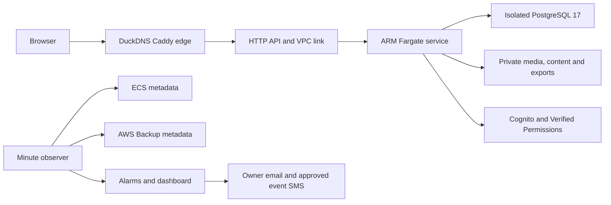

# SPOH platform infrastructure (CDK)

The AWS environments as code, per ADR-008: `staging` and `prod`, each one `PlatformStack` in
ap-southeast-1, configured in [`src/config.ts`](src/config.ts). Every resource is tagged `app`,
`env`, `owner` and `cost-centre`, and the AwsSolutions `cdk-nag` pack runs at synth: an
unsuppressed finding fails it, and a suppression must say why.

**10 October 2026 update (ADR-011): AWS is torn down.** Deploy and infra workflows are
dispatch-only. Historical deployed descriptions below describe the earlier checkpoints;
the current code is built and tested before any P16 staging recreation. Production creation,
cutover and rebuilding the deleted live site require the owner. The former production Cognito
pool and backups bucket were deleted; their historical reference identifiers must be replaced
through P12.8's approved plan before deploying production.

## Current build and operator boundaries



`OperationsMonitoring` completes the ADR-008 alarm catalogue. It adds native RDS free-storage
and connection alarms, and a minute observer of actual ECS desired/running tasks and the newest
completed AWS Backup recovery point. Missing observations breach rather than claim health.
Every alarm sends its alarm/recovery transition to the stage SNS topic. `AlarmEmail` and
`EventWeekPhone` are private NoEcho CloudFormation parameters; empty values disable the
subscription. Confirm the owner email subscription during P16.8; enable paid SMS only for the
owner-approved event period. The retained `/spoh/<stage>/audit` group has 400-day retention;
P15.4 wires the durable audit shipper.

The existing account budget was retained during teardown. `-c manageAccountBudget=true` on
Spoh-DeployAccess adds the code for one US$100 monthly budget with 80%/100% actual alerts and
a required private `BudgetEmail`. Review the existing account budget and import/reconcile it
before enabling management; default synth does not create a duplicate. Re-price dashboards,
additional metrics and the observer before rebuilding AWS.

Manual `park-staging` and `unpark-staging` workflows share the release deployment lock and use
OIDC. Park sets the staging service to zero then stops RDS; unpark waits for RDS before restoring
one task and running smoke. The script validates every resource name before any mutation and
the deploy role grants those power operations only on staging resources. RDS restarts a stopped
instance automatically after seven days; prolonged off-season retirement to a final snapshot
is an explicit owner-approved data operation rather than a power workflow.

Generate VAPID once into a private local file, then create/update its JSON Secrets Manager secret
through the approved operator path. Never print or commit its contents:

```bash
node infra/scripts/provision-vapid.mjs mailto:<operator-address> .local/vapid.json
# Store the private JSON with fields publicKey, privateKey and subject in Secrets Manager.
# Supply -c vapidSecretArn=<complete-secret-arn> at the platform release.
```

The app alone receives its three VAPID fields and an independent attendance signing secret.
Migration tasks receive neither. Existing browsers must subscribe again if the VAPID pair changes.

### Rotation under the lean network topology

**Assumed recommendation:** operator rotation through a one-off ECS migration task, preserving
the no-NAT/no-interface-endpoint topology, rather than an unreachable RDS rotation Lambda.
Automatic rotation is not enabled. Before rotation, verify a current backup and retain the previous
secret version in Secrets Manager. Put a new credential in its stage secret, then run the migrate
task: the entrypoint changes the DB role password before releasing new tasks. Old database
connections continue until replaced; new app tasks read the new secret at startup. Check smoke
and fresh task connections. A failure rolls back the secret version, reruns the credential task,
and restores the previous image; never reset or recreate the database to rotate a password.

Rotate session/attendance secrets in a controlled maintenance window and restart every app task
together: active session tokens and attendance challenges issued with the old keys expire early.
Revoke existing refresh sessions for a suspected session-key leak; a routine rotation still requires
P16 proof that users can sign in again. Retain prior key versions only for bounded rollback.
VAPID changes require renewed device subscriptions. Access Analyzer, real key rotations and
notification delivery are P16.8 acceptance evidence, not synthesis evidence.

Dependabot checks npm workspaces, GitHub Actions and the Dockerfile weekly. Keep Prisma client
and CLI versions aligned, Node images on 24, CDK CLI/lib compatible, and Cedar WASM/schema
generation together; upgrades pass unchanged coverage floors and one full batch CI before push.

```bash
npm run infra:synth              # both stages, nag checks included
npm run infra:diff               # against the deployed stacks (needs credentials)
npm run test --workspace infra/cdk
```

`Spoh-staging-Platform` is deployed and released from CI; the production stack is created at the
go decision. Bootstrapping, the GitHub OIDC role and releases are described below.

- The production Cognito pool `ap-southeast-1_9bwl2nGF7` is referenced by id, never owned: every
  `Volunteer.cognitoSub` points into it.
- Production routing still has unused placeholders: D-08 now requires Firebase Hosting for
  the client and a DuckDNS HTTPS API. Its concrete identifiers and deployment remain subject
  to the owner boundaries; no Route 53 domain is required.

## Access from CI (P08.2)

The account is bootstrapped (`cdk bootstrap aws://665146708212/ap-southeast-1`, default qualifier,
tagged). The `Spoh-DeployAccess` stack holds GitHub's OIDC provider and the role
`spoh-github-deploy`, which a workflow may assume only from `aadk979/SPOH_2027` (matched by its
immutable owner and repository ids, `aadk979@138833125/SPOH_2027@1379786785`) on `main` or in the
`staging` or `prod` deployment environment. Its only permission is to assume the four CDK bootstrap
roles, so everything CI changes goes through CloudFormation. `.github/workflows/infra.yml` runs
`cdk diff` with it; no workflow holds static keys.

The bootstrap and this stack were deployed once from a workstation with the owner's approval
(2026-09-29, D-13). To change the role, edit `src/deployAccessStack.ts` and deploy
`Spoh-DeployAccess` the same way, or from CI once P08.9 adds deploys.

## Releases and one-off tasks (P08.4, P08.10)

`.github/workflows/deploy-staging.yml` runs after CI succeeds on `main`: it pushes the image, deploys
the stack with the new task definitions, runs the migrate task
([`infra/scripts/run-migrate-task.mjs`](../scripts/run-migrate-task.mjs)), moves the service to the
release and runs the smoke test.

The migrate task definition also runs the container entrypoint's one-off commands against the
stage's database, with the current release's image:

```bash
node infra/scripts/run-migrate-task.mjs - Spoh-staging-Platform seed    # idempotent seed (production shape)
node infra/scripts/run-migrate-task.mjs - Spoh-staging-Platform seed-fixture # two synthetic event fixtures, staging only
node infra/scripts/run-migrate-task.mjs - Spoh-staging-Platform totals  # P09 totals check, read-only
```

`-` reads the stack outputs from CloudFormation; the task's log is printed when it stops. All run
as the app role. `seed-fixture` overrides `NODE_ENV` for that one-off staging task only. The API
service stays in production mode, and a production stack name is refused before any AWS call.

## Configuration migration boundary (P10.4 / P08.6)

The P10.4 audit checkpoint found no application SSM parameters to remove in Singapore.
P08.6 defines standard `String` parameters under `/spoh/<stage>/infra/<ENV_NAME>` and
injects them at task startup: 16 for staging, 14 for the unchanged production definition.
The app execution role can read only its stage's exact injected parameters; the
migration execution role reads only `DB_HOST` and `DB_NAME`. Application task roles do not gain
SSM access. Credentials remain in Secrets Manager, and no environment file is included in an image.

Staging now selects the verified DuckDNS API/client origins together for callback,
browser redirects, logout and credentialed CORS, and injects `DEPLOYMENT_ENV=staging`.
Production retains the previous API Gateway origin and reference-only Cognito configuration.
The closest API Gateway hop remains the only trusted proxy hop. Infrastructure
values are code-owned and released through CDK/CI: ECS does not reload changed parameters into
running containers, so changing a parameter requires a new task deployment. Operational live
settings retain their database/cache-bus path. See the
[`P08.6 verification report`](../../remediation/reports/P08/infrastructure-configuration.md).
Secret completion, rotation and Access Analyzer verification remain open.

## Private storage foundation (partial P08.7)

`ObjectStorage` defines retained media, versioned content and 90-day exports,
with a separate 30-day access-log bucket. All four block public access, disable
ACLs, use S3-managed encryption and deny non-TLS access. Log delivery is scoped
to the exact source bucket, account and prefix. Media CORS permits only signed
POSTs from the configured exact HTTPS client origin; no production origin means
no production CORS rule.

The existing `spoh2027-backups-665146708212` bucket is referenced by name only.
CDK takes no ownership of it and changes none of its policies, lifecycle or
permissions. Stack outputs expose the three data bucket names and the existing
backup name. Application access and SSM injection remain separate: this
foundation grants no task S3 permissions and does not enable media uploads.

Media expiry must follow the event's CLOSED instant (ADR-003 §8); there is no
upload-age deletion rule. Content versions are retained. Deleting or replacing a
stack retains all owned buckets and their objects; any later removal is a
separate, explicit data-disposal operation. See the
[verification, retention and cost boundary](../../remediation/reports/P08/private-storage-foundation.md).

The separate app wiring enables media when the stage has an approved exact
public client origin. A standard `/spoh/<stage>/infra/S3_MEDIA_BUCKET` parameter
injects the owned bucket name into the app only. Its task role has GetObject and
PutObject on that bucket's `lost-found/*` prefix; migration tasks have no storage
injection or S3 grant. The static client's CSP derives the exact regional bucket
origin, and signed private GETs return `no-store`. Content/exports/backups and
object deletion receive no application grant. See the
[private media verification](../../remediation/reports/P08/private-media-wiring.md).

For a review that preserves the actual running app, supply its verified image
tag in both contexts:

```bash
npx cdk diff Spoh-staging-Platform Spoh-DeployAccess --no-change-set \
  -c imageTag=<verified-current-image> -c serviceImageTag=<verified-current-image>
```

An image-less platform diff omits the existing app construct and therefore also
shows proposed app removals; review with both image contexts before a release.
Production remains review-only until the owner go decision.

## Scheduler monitoring (P08.8 / P10.6)

The app log group supplies two fixed-cardinality scheduler gauges in `SPOH/<stage>`;
one-minute alarms use Maximum across worker observations. The lag alarm requires two minutes
over 60 seconds; any dead action alarms after one minute. Missing observations preserve the
previous state. Alarm names are stack outputs. SNS actions/subscriptions, worker availability
and the remaining alarm catalogue are pending; these detection alarms alone do not notify the
owner. See the [verification and cost boundary](../../remediation/reports/P08/scheduler-monitoring.md).

The native HTTP API alarms detect a five-minute 5xx rate over 1% and p95 latency over 300 ms
in two of three minutes. They use only the actual API id and existing basic metrics, with no
paid route dimensions. Missing request data is non-breaching; availability and owner SNS
delivery remain pending. See the [HTTP alarm evidence and cost](../../remediation/reports/P08/http-monitoring.md).

The native RDS CPU alarm uses the actual database identifier, Average over 90% in five
consecutive minutes, with missing observations left insufficient. It changes no database
parameters and has no notification actions. Free storage/connection limits and owner delivery
remain pending. See the [database CPU evidence and cost](../../remediation/reports/P08/database-cpu-monitoring.md).

The cache-bus heartbeat reports connection bypass as a bounded 0/1 gauge before each
worker claim. Maximum across reporting instances alarms for two of three minutes of
degradation; missing observations remain insufficient. It uses the existing app log
group without per-instance metric dimensions or extra permissions. Owner delivery and
worker availability remain pending. See the
[cache-bus evidence and cost](../../remediation/reports/P08/cache-bus-monitoring.md).

The task-failure detector selects stopped app service tasks with
`EssentialContainerExited` or `TaskFailedToStart`, scoped to the actual cluster,
service, account and region. A native EventBridge target stores only the event
time, task identifier and bounded stop code in a retained 30-day log group.
Its log policy restricts delivery to that stage's rule/account, and its one-minute
alarm detects any matching event. It creates no Lambda or task grants and keeps
Container Insights disabled. Intentional stops, one-off tasks and scheduler-driven
health-check replacements are outside this bounded signal; running-task availability,
the wider restart catalogue and SNS delivery remain open. See the
[definition verification and rollout requirements](../../remediation/reports/P08/task-failure-monitoring.md).

## Staging HTTPS proxy (P08.5)

`-c stagingEdge=true` adds the separate `Spoh-staging-Edge` stack. Provision only that stack,
with its `ApiOrigin` parameter set to staging's `AppUrl` and `OperatorSshCidr` to the current
operator IPv4 /32. It creates the approved new US$7/month Micro and attached static IP;
the automatic platform release does not deploy this stack. The owner points the client/API
DuckDNS names at the `PublicIp` output. Caddy's HTTP/TLS-ALPN validation then obtains and
renews certificates without a DuckDNS token. See the
[`staging proxy report`](../../remediation/reports/P08/staging-edge.md) for verification and limits.
Updating instance user data is not a live Caddy configuration reload; deploy/reload verified
configuration on the named new proxy explicitly. Preserve the existing live Lightsail site.

For separate client/API origins, `APP_BASE_URL` keeps the API callback and optional
`CLIENT_BASE_URL` selects the post-sign-in browser destination. See the
[`sign-in origin report`](../../remediation/reports/P08/sign-in-origins.md). This optional
key is injected for staging with the combined routing, Cognito and CORS change after
HTTPS and the [runtime client startup](../../remediation/reports/P08/client-runtime-startup.md)
were verified. Client API routing uses ADR-003 runtime config. See the
[combined staging wiring report](../../remediation/reports/P08/staging-origins.md) for the
deployment checkpoint and remaining real-account/iOS verification.

Do not introduce operational parameters or environment overrides for attendance root/networks,
rehearsal, upload lifetime/size, access-token lifetime or rate limits. They use the versioned
settings registry or event lifecycle, as listed in
[`env-migration.md`](../../remediation/reports/P10/env-migration.md). Container `DB_HOST`,
`DB_NAME` and credential inputs construct the server's `DATABASE_URL` at entrypoint; they do
not add operational configuration. Keep this boundary when adding SSM injection in P08.6.
